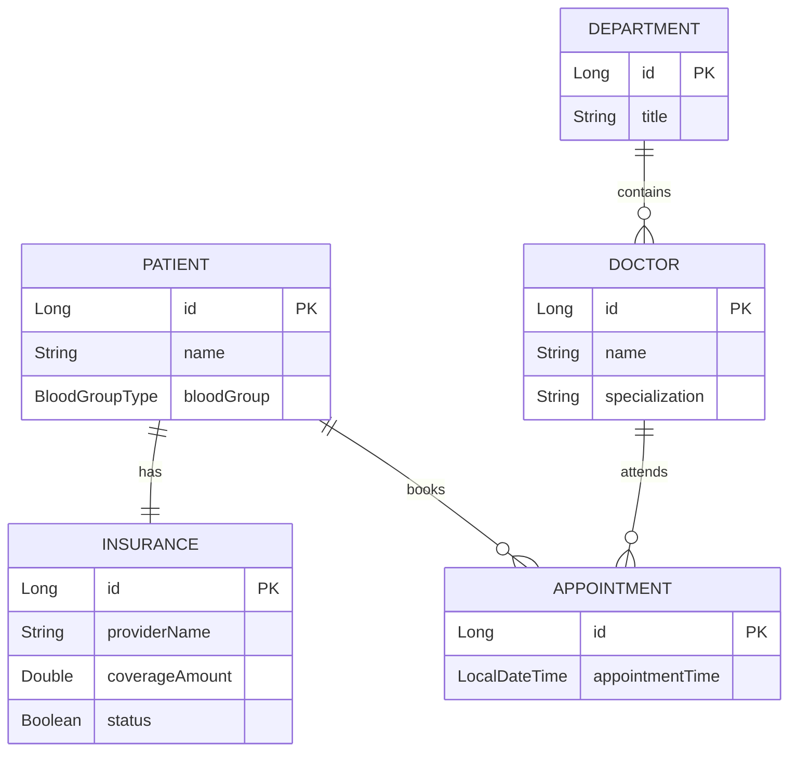

# 🏥 Hospital Management System (Spring Boot Data JPA Learning Project)

[](https://spring.io/projects/spring-boot)
[](https://openjdk.org/projects/jdk/21/)
[](https://www.postgresql.org/)
[](https://hibernate.org/)

This is a personal learning project built side-by-side with YouTube tutorials to master **Spring Boot**, **Spring Data JPA**, **Hibernate**, and **PostgreSQL**. The project implements a backend API for a standard Hospital Management System containing entities like Patients, Doctors, Appointments, and Departments.

---

## 🧠 Key Learning Takeaways

Building this project helped me understand and practice several critical backend development concepts:

1. **JPA Entity Mappings & Relationships**:
   * **`OneToOne`**: Linking a `Patient` to their `Insurance` details.
   * **`OneToMany` / `ManyToOne`**: Mapping relationships such as `Department` having many `Doctors`, and `Doctor`/`Patient` having multiple `Appointments`.
   * **`ManyToMany`**: Implementing multi-role permissions mapping user groups.
2. **DTO (Data Transfer Object) Pattern**:
   * Decoupled database entities from HTTP request/response payloads to prevent security leakage and maintain API flexibility.
   * Practiced mapping entities to DTOs using **ModelMapper**.
3. **Database Architecture**:
   * Used **PostgreSQL** as the primary relational database.
   * Populated mock datasets automatically on application startup using `data.sql` and Hibernate initializers.
4. **Spring MVC Architecture**:
   * Structured the project into clean layers: `Controllers` (HTTP routing) ➡️ `Services` (Business logic) ➡️ `Repositories` (Data access using Spring Data JPA) ➡️ `Entities` (Database schemas).

---

## 🗺️ Database Schema & Entities

The relational database model covers the core workflow of a hospital system:



---

## ⚡ REST API Endpoints

All endpoints are prefixed with the base path `/api/v1`.

### 🩺 Public Services (`/api/v1/public`)
| Method | Endpoint | Description |
| :--- | :--- | :--- |
| `GET` | `/public/doctors` | Get a list of all active doctors in the hospital. |

### 👤 Patient Services (`/api/v1/patients`)
| Method | Endpoint | Description | Request Body |
| :--- | :--- | :--- | :--- |
| `GET` | `/patients/profile` | Retrieve profile data for the current logged-in patient. | *None* |
| `POST` | `/patients/appointments` | Book a new appointment with a doctor. | `CreateAppointmentRequestDto` |

### 🥼 Doctor Services (`/api/v1/doctors`)
| Method | Endpoint | Description |
| :--- | :--- | :--- |
| `GET` | `/doctors/appointments` | View all scheduled appointments for the doctor. |

### 🔑 Administrator Services (`/api/v1/admin`)
| Method | Endpoint | Description | Query Parameters |
| :--- | :--- | :--- | :--- |
| `GET` | `/admin/patients` | Retrieve list of all patients (paginated). | `page` (default 0), `size` (default 10) |

---

## 🚀 Getting Started Locally

### Prerequisites
* **Java 21 JDK** installed.
* **PostgreSQL** server running locally.
* **Maven** (packaged wrapper `./mvnw` is included in the project).

### Configuration
Update the database connection details in `src/main/resources/application.properties`:

```properties
spring.datasource.url=jdbc:postgresql://localhost:5432/hospitalDB
spring.datasource.username=YOUR_POSTGRES_USERNAME
spring.datasource.password=YOUR_POSTGRES_PASSWORD
```

### Running the Project
1. Clone the repository to your local machine.
2. Build the project using Maven:
   ```bash
   ./mvnw clean install
   ```
3. Run the Spring Boot application:
   ```bash
   ./mvnw spring-boot:run
   ```
4. Access the API locally at: `http://localhost:8080/api/v1`

---

### Credits
* Tutorial course content by **Anuj Kumar Sharma** (Coding Shuttle).
